# Infact Analytics

### Architecture Overview

```mermaid
flowchart TB
    Query["'What skills are taught in the CS61A program at UC Berkeley?'"]:::query
    
    Query --> Break
    
    Break["🔍 Break into Sub-Questions"]:::primary
    
    subgraph SubQ["🌐 Search Queries"]
        S1["What are the main topics covered in CS61A at UC Berkeley?"]:::search
        S2["Which programming paradigms are introduced in CS61A?"]:::search
        S3["What data structures and algorithms are included in the CS61A curriculum?"]:::search
    end
    
    Break --> SubQ
    
    subgraph FC["Infact API Calls"]
        FC1["Infact /search API<br/>Query 1"]:::infact
        FC2["Infact /search API<br/>Query 2"]:::infact
        FC3["Infact /search API<br/>Query 3"]:::infact
    end
    
    S1 --> FC1
    S2 --> FC2
    S3 --> FC3
    
    subgraph Sources["📄 Sources Found"]
        R1["cs61a.org ✓<br/>guide.berkeley.edu ✓<br/>csdiy.wiki ✓"]:::source
        R2["people.eecs.berkeley.edu ✓<br/>talk.collegeconfidential.com ✓<br/>aweberkeley.medium.com ✓"]:::source
        R3["quora.com ✓<br/>eecs.berkeley.edu ✓"]:::source
    end
    
    FC1 --> R1
    FC2 --> R2
    FC3 --> R3
    
    subgraph Valid["✅ Answer Validation"]
        V1["CS61A at UC Berkeley teaches programming concepts using Python, Scheme, and SQL. ✓ (0.95)"]:::good
        V2["CS61A teaches programming concepts like abstraction, functional programming, and data abstraction using Scheme. ✓ (0.9)"]:::good
        V3["CS61A at UC Berkeley emphasizes labs, homework, projects, and exams for skill development. ❌ (0.3)"]:::bad
    end
    
    Sources --> Valid
    
    Valid --> Retry
    
    Retry{"Need info:<br/>Skills taught in CS61A program at UC Berkeley?"}:::check
    
    subgraph Strat["🧠 Alternative Strategy"]
        Original["Original: 'Skills taught in CS61A program at UC Berkeley?'<br/>❌ Full list of skills not found"]:::bad
        NewTerms["Try: 'Programming Languages taught in CS61A program at UC Berkeley?'<br/>'Computational Thinking taught in CS61A program at UC Berkeley?'<br/>'CS61A Course Structure related to Computer Programming?'"]:::strategy
    end
    
    Retry -->|Yes| Strat
    
    subgraph Retry2["🔄 Retry Searches"]
        Alt1["Programming Languages taught in CS61A program at UC Berkeley?"]:::search
        Alt2["Computational Thinking taught in CS61A program at UC Berkeley?"]:::search
        Alt3["CS61A Course Structure related to Computer Programming?"]:::search
    end
    
    Strat --> Retry2
    
    subgraph FC2G["🔥 Retry API Calls"]
        FC4["Infact /search API<br/>Alt Query 1"]:::infact
        FC5["Infact /search API<br/>Alt Query 2"]:::infact
        FC6["Infact /search API<br/>Alt Query 3"]:::infact
    end
    
    Alt1 --> FC4
    Alt2 --> FC5
    Alt3 --> FC6
    
    Results2["Python ✓<br/>SQL ✓<br/>Data Abstractions ✓<br/>Object-Oriented Programming ✓<br/>Functional Programming ✓<br/>Algorithm Design ✓<br/>Macros ✓"]:::source
    
    FC4 --> Results2
    FC5 --> Results2
    FC6 --> Results2
    
    Final["All answers found ✓"]:::good
    
    Results2 --> Final
    
    Synthesis["LLM synthesizes response"]:::synthesis
    
    Final --> Synthesis
    
    FollowUp["Generate follow-up questions"]:::primary
    
    Synthesis --> FollowUp
    
    Citations["List citations [1-10]"]:::primary
    
    FollowUp --> Citations
    
    Answer["Complete response delivered"]:::answer
    
    Citations --> Answer
    
    %% No path - skip retry and go straight to synthesis
    Retry -->|No| Synthesis
    
    classDef query fill:#ff8c42,stroke:#ff6b1a,stroke-width:3px,color:#fff
    classDef subq fill:#ffd4b3,stroke:#ff6b1a,stroke-width:1px,color:#333
    classDef search fill:#ff8c42,stroke:#ff6b1a,stroke-width:2px,color:#fff
    classDef source fill:#3a4a5c,stroke:#2c3a47,stroke-width:2px,color:#fff
    classDef check fill:#ffeb3b,stroke:#fbc02d,stroke-width:2px,color:#333
    classDef good fill:#4caf50,stroke:#388e3c,stroke-width:2px,color:#fff
    classDef bad fill:#f44336,stroke:#d32f2f,stroke-width:2px,color:#fff
    classDef strategy fill:#9c27b0,stroke:#7b1fa2,stroke-width:2px,color:#fff
    classDef synthesis fill:#ff8c42,stroke:#ff6b1a,stroke-width:3px,color:#fff
    classDef answer fill:#3a4a5c,stroke:#2c3a47,stroke-width:3px,color:#fff
    classDef infact fill:#ff6b1a,stroke:#ff4500,stroke-width:3px,color:#fff
    classDef label fill:none,stroke:none,color:#666,font-weight:bold
```

### Process Flow

1. **Break Down** - Complex queries split into focused sub-questions
2. **Query** - Multiple queries via Infact API for comprehensive coverage
3. **Extract** - Markdown content extracted from multiple sources
4. **Validate** - Check if sources actually answer the questions (0.7+ confidence)
5. **Retry** - Alternative query terms for unanswered questions (max 3 attempts)
6. **Synthesize** - Qwen2.5-32B-Instruct (gpt-4o-mini level capabilities) combines findings into cited answer

### Key Features

- **Smart Queries** - Breaks complex queries into multiple focused queries
- **Answer Validation** - Verifies sources contain actual answers (0.7+ confidence)
- **Auto-Retry** - Alternative query terms for unanswered questions
- **Real-time Progress** - Live updates as queries complete
- **Full Citations** - Every fact linked to its source
- **Context Memory** - Follow-up questions maintain conversation context

### Strategies

When initial results are insufficient, the system automatically tries:
- **Broaden Keywords**: Removes specific terms for wider results
- **Narrow Focus**: Adds specific terms to target missing aspects
- **Synonyms**: Uses alternative terms and phrases
- **Rephrase**: Completely reformulates the query
- **Decompose**: Breaks complex queries into sub-questions
- **Academic**: Adds scholarly terms for research-oriented results
- **Practical**: Focuses on tutorials and how-to guides

## Example Queries

- "What skills are taught in the CS61A program at UC Berkeley?"
- "What are the top job openings for Software Engineers in San Francisco?"
- "Compare layoffs in Tech vs Finance sectors."
