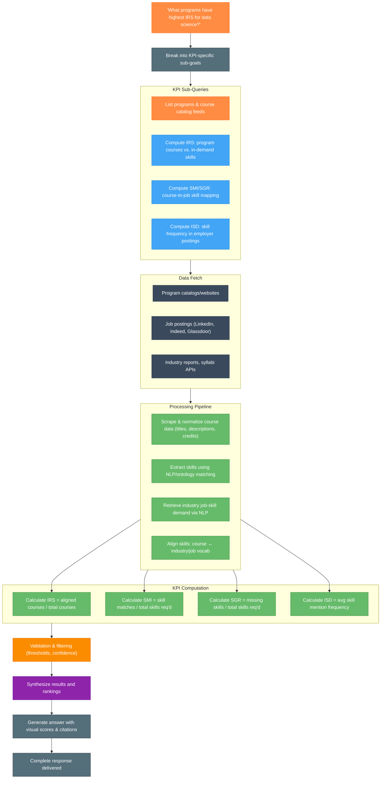
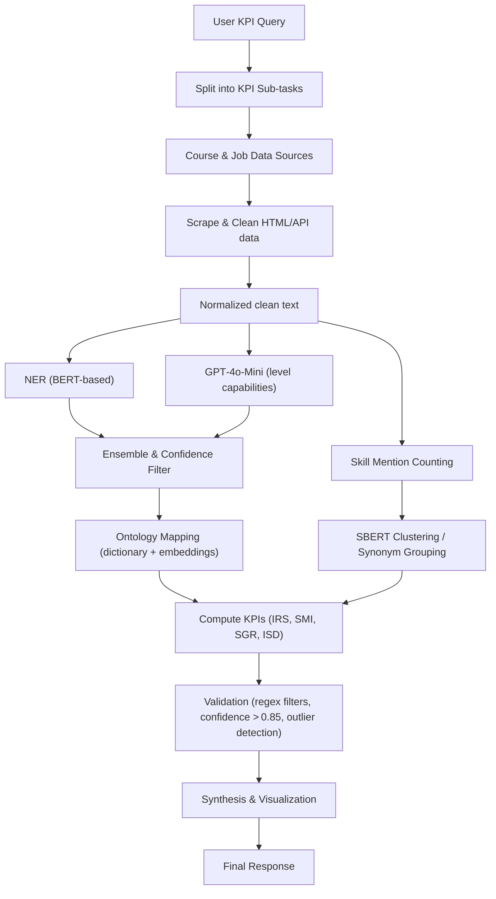

# Infact Analytics

## Architecture Overview for KPIs

### Query Flow

1. User Query Breakdown
    - The system splits the main question into sub-questions targeting each KPI (IRS, SMI, SGR, ISD, etc.).
2. Data Fetching
    - Program catalogs: Scrape university/program sites for course lists and metadata.
    - Job postings: Collect skill requirements from platforms like LinkedIn, Indeed.
    - Industry reports/syllabi APIs: Include accreditation data and publicly available syllabi.
3. Processing Pipeline
    - Normalize scraped data (titles, descriptions, credit hours).
    - Use NLP and a skills ontology to extract and standardize skills mentioned.
    - From job postings and reports, build an industry-demand skill dataset.
    - Align and match skills between courses and industry/job taxonomies.
4. KPI Calculations
    - IRS: % of courses aligned with in-demand skills.
    - SMI: % of required job skills actually taught in courses.
    - SGR: % of job-required skills missing from course content.
    - ISD: Average frequency of skill mentions in job postings (demand intensity).
5. Validation & Synthesis
    - Filter by confidence thresholds (e.g. only keep IRS ≥ 80%).
    - Synthesize an answer: rank programs or courses, provide KPI breakdown, visualize.
6. Output
    - Present program/course recommendations with IRS, SMI, SGR, ISD scores.
    - Include supporting citations/links to scraped sources and job-skill data.

### Process Flow

1. Data Ingestion & Normalization

| Stage                  | Model/Tool                                    | Why it fits                                                                  |
| ---------------------- | --------------------------------------------- | ---------------------------------------------------------------------------- |
| HTML/API scraping      | Lyra (Scraper from Outpost)                   | Lightweight, battle‑tested for arbitrarily‑structured web pages              |
| Raw text normalization | Lyra (Regex & Rule‑based)                     | Simple cleaning (remove HTML tags, boilerplate noise) is faster than ML here |

2. Skill Extraction (“Which skills does this course/job post mention?”)

| Stage                           | Model/Tool                                                | Why it fits                                                                                                              |
| ------------------------------- | --------------------------------------------------------- | ------------------------------------------------------------------------------------------------------------------------ |
| Entity / Skill phrase detection | Fine‑tuned NER (BERT‑based)                               | Pre‑trained on general English, fine‑tunable to recognize “Python”, “machine learning”, etc., with high precision/recall |
| Ontology mapping                | Dictionary lookup + embedding match (e.g. fastText)       | Catch synonyms (“PyTorch” → “python”) and map to canonical skill IDs                                                     |

Analogy:
> Think of Fine‑tuned NER (BERT‑based) as your “skill spotlight” that highlights every mention of a skill; the ontology matcher then says, “Ah, that spotlighted bit ‘PyTorch’ is really just a flavor of ‘Python.’”

3. Demand Extraction (“How often do employers ask for these skills?”)

| Stage                   | Model/Tool                                  | Why it fits                                                    |
| ----------------------- | ------------------------------------------- | -------------------------------------------------------------- |
| Job‑posting scraping    | Same as above                               | Keep your stack consistent                                     |
| Skill mention counting  | Count occurrences of extracted skill tokens | Simple frequency counts work as a first‑order proxy for demand |
| Advanced demand scoring | Sentence‑BERT embeddings + clustering       | Groups similar postings, smooths out noise across synonyms     |

Analogy:
> Fine‑tuned NER (BERT‑based) is like giving a waiter a list of detailed menu items and asking them to read every customer order, tagging every phrase that fits each menu description—even if the customer uses a creative or unusual name for the dish. The waiter doesn’t group similar items together; they simply spot and label every mention that matches your menu, no matter how it’s phrased.

4. KPI Computation & Matching

| KPI                         | Formula                                         | Matching mechanism                                                                |
| --------------------------- | ----------------------------------------------- | --------------------------------------------------------------------------------- |
| IRS (Industry Relevance)    | aligned\_courses / total\_courses               | Does “course\_skills” ∩ “industry\_top\_skills” ≥ threshold? Use set intersection |
| SMI (Skill Match Index)     | total\_skill\_matches / total\_skills\_required | For each target job role, compare extracted skill set vs. required\_skills list   |
| SGR (Skill Gap Ratio)       | missing\_skills / total\_skills\_required       | Complement of SMI                                                                 |
| ISD (Industry Skill Demand) | avg\_skill\_mention\_frequency across postings  | From demand extraction above                                                      |

How “Python” gets matched:

1. Extraction: Fine‑tuned NER (BERT‑based) has tagged “Python” in the course description.
2. Normalization: Ontology maps “Python 3” → skill_id=SKL_0001 (canonical).
3. Comparison:
    - If Python ∈ course_skills and Python ∈ industry_top_skills → it counts as an “aligned” course for IRS.
    - If Python is in required_skills for Data Engineer, it contributes to SMI.

5. Validation & Confidence

| Stage                    | Model/Tool                         | Role                                                                        |
| ------------------------ | ---------------------------------- | --------------------------------------------------------------------------- |
| False‑positive filtering | Rule‑based filters + regex checks  | E.g., ignore “python” when it’s in code samples snippet, not in description |
| Confidence scoring       | Embedding‑distance thresholds      | Only accept NER (BERT‑based) extractions whose tag confidence ≥ 0.85        |
| Outlier detection        | Isolation Forest or simple z‑score | Flag courses with extremely low/high IRS for manual review                  |

Analogy:
> Treat validation like a quality‑control line on an assembly belt—anything that falls below your confidence “height” or looks like an outlier gets kicked aside for manual QC.

